# Spanning Tree Projects 
### STP, RSTP, PVST+, Port-Security, Guard Root, BPDU

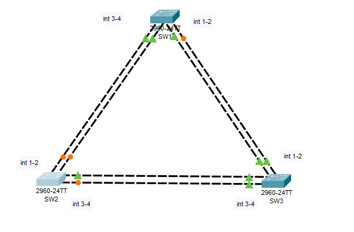
## Overview
We will build a network with three switches connected in a triangle topology and configure different Spanning Tree Protocol versions:

1. **STP (Standard Spanning Tree Protocol)** – Prevents loops but has slow convergence.
2. **RSTP (Rapid Spanning Tree Protocol)** – Faster recovery time than STP.
3. **PVST+ (Per VLAN Spanning Tree)** – Separate STP instances for each VLAN.


# Project 1: Basic STP Configuration
**Objective**\
Set up Spanning Tree Protocol (STP) to prevent loops in a simple network.

**Topology**:
3 Cisco 2960 switches (SW1, SW2, SW3) connected in a triangle.\
Each switch has trunk ports connecting to the other two.

**Basic Switch Configuration**

```
enable
configure terminal
hostname SW1(2,3)
no ip domain-lookup
line console 0
logging synchronous
exec-timeout 20
end
copy running-config startup-config
```
**Result**

```
SW1#sh running-config 
Building configuration...

Current configuration : 1229 bytes
!
version 15.0
no service timestamps log datetime msec
no service timestamps debug datetime msec
no service password-encryption
!
hostname SW1
!
!
!
no ip domain-lookup
interface Vlan1
 no ip address
 shutdown
!
!
!
!
line con 0
 logging synchronous
 exec-timeout 20 0
!
line vty 0 4
 login
line vty 5 15
 login
!
!
!
!
end
```


## Configuration Steps:

**Step 1: Configure Basic Network**
Connect SW1, SW2, SW3 using trunk links (e.g., Fa0/1 and Fa0/2).\

**Step 2 Configure Trunk Ports on All Switches**
```
SW(config)# interface range fa0/1 - 2
SW(config-if-range)# switchport mode trunk
SW(config-if-range)# exit

SW(config)# interface range fa0/3 - 4
SW(config-if-range)# switchport mode trunk
SW(config-if-range)# exit

```

**Step 3: Enable STP and Verify**
Check if STP is running:

```
SW# show spanning-tree
SW# show spanning-tree int f0/1 (2,3,4)
SW# show spanning-tree detail
```
**Ports**

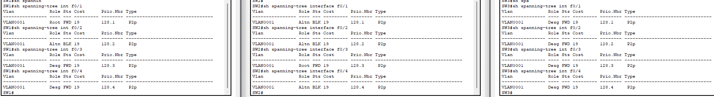

**Root Bridge**

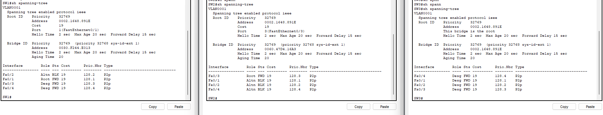


**Step 4: Set Root Bridge (SW1 as Root)**
```
SW1(config)# spanning-tree vlan 1 priority 0
```
(The lowest priority switch becomes the root bridge.)

**Step 5: Verify STP Operation**
```
SW1# show spanning-tree
```
**Step 6 Set Root Bridge SW1(in my case is RB SW3) as Root**
```
SW1(config)#spanning-tree vlan 1 priority 0
```
**Verify STP Operation**
```
SW1# show spanning-tree
```
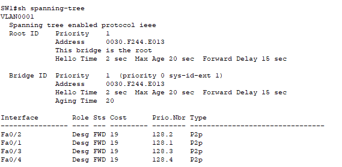

**Return**
```
SW1(config)#spanning-tree vlan 1 priority 32768
```

```
SW3 #sh spanning-tree 
```

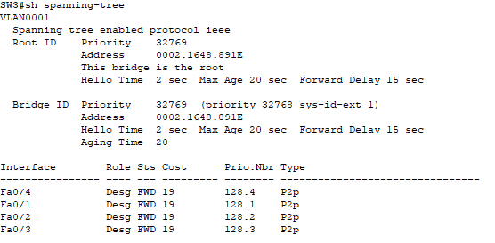


## Verifying STP (Standard Spanning Tree Protocol)

**Check if STP is running and which switch is the Root Bridge**
```
SW# show spanning-tree
```

+ Verify the Root Bridge for VLAN 1.
+ Look for Blocking and Forwarding ports.

**Check the STP state of a specific interface**
```
SW# show spanning-tree interface fa0/1
```

See if the port is in Forwarding, Blocking, or Listening state.

**Test STP failover**
+ Physically disconnect one trunk link and check if a Blocked port becomes active.
+ Run the command again to verify:
```
SW# show spanning-tree
```
+ One port should be in blocking state to prevent loops.
+ If you disconnect an active link, the blocked port should become active.


#  Spanning Tree with End Devices


This setup includes **PCs(2x) connected to access ports**, allowing you to configure **PortFast and additional STP security features.**


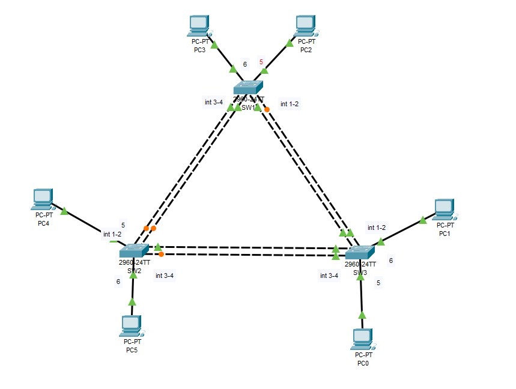

## 1. Enabling PortFast, Disable all unused ports and Testing It

**Assign a management IP (need for a PortFast and Root Guard )**

| PC  | Switch | Port  | VLAN | IP Address      | Subnet Mask       | Gateway         |
|-----|--------|-------|------|---------------|-----------------|----------------|
| PC1 | SW1    | Fa0/5 | 10   | 192.168.10.11 | 255.255.255.0   | 192.168.10.1   |
| PC2 | SW1    | Fa0/6 | 10   | 192.168.10.12 | 255.255.255.0   | 192.168.10.1   |
| PC3 | SW2    | Fa0/5 | 20   | 192.168.20.11 | 255.255.255.0   | 192.168.20.1   |
| PC4 | SW2    | Fa0/6 | 20   | 192.168.20.12 | 255.255.255.0   | 192.168.20.1   |
| PC5 | SW3    | Fa0/5 | 30   | 192.168.30.11 | 255.255.255.0   | 192.168.30.1   |
| PC6 | SW3    | Fa0/6 | 30   | 192.168.30.12 | 255.255.255.0   | 192.168.30.1   |


**Disable unused ports (let’s assume ports 7–24 are unused):**
```
SW(config)# interface range fa0/7 - 24
SW(config-if-range)# shutdown
SW(config-if-range)# exit
SW(config)#int range g0/1-2
SW(config-if-range)# shutdown
SW(config-if-range)# exit
```

```
interface FastEthernet0/1
 switchport mode trunk
!
interface FastEthernet0/2
 switchport mode trunk
!
interface FastEthernet0/3
 switchport mode trunk
!
interface FastEthernet0/4
 switchport mode trunk
!
interface FastEthernet0/5
!
interface FastEthernet0/6
!
interface FastEthernet0/7
 shutdown
!
interface FastEthernet0/8
 shutdown
!
interface FastEthernet0/9
 shutdown
!
interface FastEthernet0/10
 shutdown
!
interface FastEthernet0/11
 shutdown
!
interface FastEthernet0/12
 shutdown
!
interface FastEthernet0/13
 shutdown
!
interface FastEthernet0/14
 shutdown
!
interface FastEthernet0/15
 shutdown
!
interface FastEthernet0/16
 shutdown
!
interface FastEthernet0/17
 shutdown
!
interface FastEthernet0/18
 shutdown
!
interface FastEthernet0/19
 shutdown
!
interface FastEthernet0/20
 shutdown
!
interface FastEthernet0/21
 shutdown
!
interface FastEthernet0/22
 shutdown
!
interface FastEthernet0/23
 shutdown
!
interface FastEthernet0/24
 shutdown
!
interface GigabitEthernet0/1
shutdown
!
interface GigabitEthernet0/2
shutdown
```
### Configure trunk ports (fa0/3–fa0/4):

**For the trunk ports between switches, you need to enable Root Guard to prevent any non-root bridge from becoming the Root Bridge:**
**My RB is SW3:**

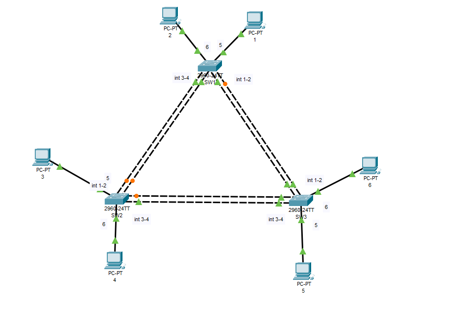
```
SW1(config)# interface f0/7
SW1(config-if-range)# spanning-tree guard root
SW1(config-if-range)# no shutdown
SW1(config-if-range)# end
```
**Verification of Root Guard:**
```
SW1# show spanning-tree interface f0/7 
```
If Root Guard is active, the port remains Forwarding. If it receives an unexpected superior BPDU, it moves to Root Inconsistent (Blocking) mode.


**Test Root Guard:**

 Add switch on int f0/7
 
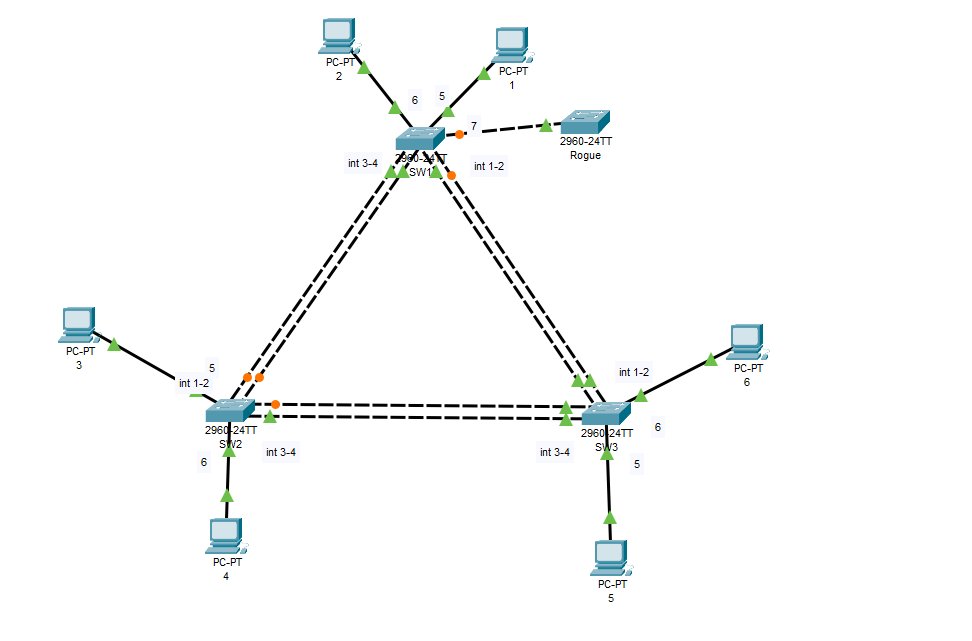
 
```
Rogue(config)# spanning-tree vlan 1 priority 0
```
+ Check if Root Guard blocks the port:

Message 
```
SW1#%SPANTREE-2-ROOTGUARDBLOCK: Port 0/7 tried to become non-designated in VLAN 1.

Moved to root-inconsistent state
```
```
SW1#show spanning-tree inconsistentports 
Name                 Interface            Inconsistency
-------------------- -------------------- ------------------
VLAN0001             FastEthernet0/7      Root Inconsistent

Number of inconsistent ports (segments) in the system : 1
```

###  Configure PortFast on access ports (F0/5-6)


PortFast allows access ports to skip STP’s Listening and Learning states, immediately transitioning to **Forwarding.**
```
SW1-3(config)# interface range f0/5-6 SW1 only int f0/6
SW1-3(config-if-range)# spanning-tree portfast
SW1-3(config-if-range)# end
```
+ Verification of PortFast:
```
SW# sh running-config
```
If PortFast is enabled, the port should be in Forwarding immediately after connecting a device.

**Test PortFast:**
+ Disconnect PC 1 and 2
+ Connect a PC to F0/5 or F0/6.
+ Run a ping (192.168.10.12 from PC 1 and 192.168.10.11 from PC 2) test immediately after connecting to verify that there’s no delay in link activation.

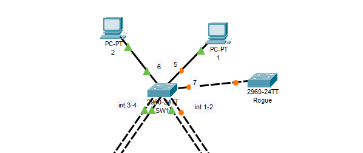


### Configure BPDU Guard on PortFast ports (F0/5-6)
BPDU Guard shuts down a port if it receives BPDU packets (protecting against misconfigurations and loops).

```
SW2(config)# interface range f0/5 - 6
SW2(config-if-range)# spanning-tree bpduguard enable
SW2(config-if-range)# end
```
**Verification of BPDU Guard:**
```
SW2# show spanning-tree interface f0/5 detail
SW2# sh running-config 
interface FastEthernet0/5
 spanning-tree portfast
 spanning-tree bpduguard enable
!
interface FastEthernet0/6
 spanning-tree portfast
 spanning-tree bpduguard enable
```
If a BPDU is received, the port enters err-disabled mode.

**Test BPDU Guard:**

+ Connect another switch to F0/5 or F0/6 and enable trunking to send BPDUs:

```
BPDU(config)# interface f0/1
BPDU(config-if)# switchport mode trunk
```
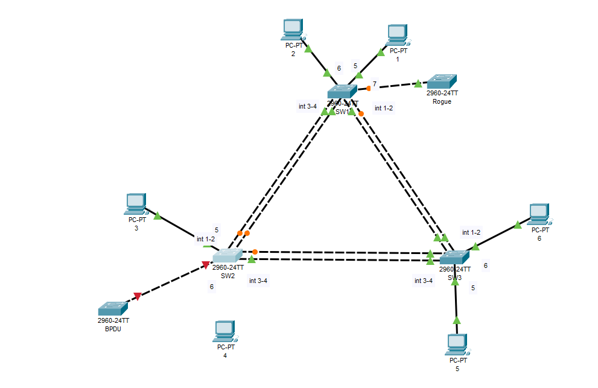
```
SW2#%SPANTREE-2-BLOCK_BPDUGUARD: Received BPDU on port FastEthernet0/6 with BPDU Guard enabled. Disabling port.

%PM-4-ERR_DISABLE: bpduguard error detected on 0/6, putting 0/6 in err-disable state


%LINK-5-CHANGED: Interface FastEthernet0/6, changed state to administratively down

%LINEPROTO-5-UPDOWN: Line protocol on Interface FastEthernet0/6, changed state to down
```

+ Check if BPDU Guard err-disables the port:
```
SW2# show interfaces status | include err-disabled
```

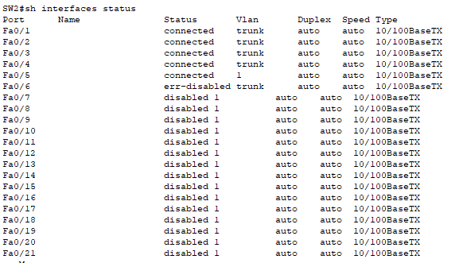

+ Recover the port by shutting it down and re-enabling:
```
SW2(config)# interface f0/6
SW2(config-if)#no switchport mode trunk
SW2(config-if)# shutdown
SW2(config-if)# no shutdown
```
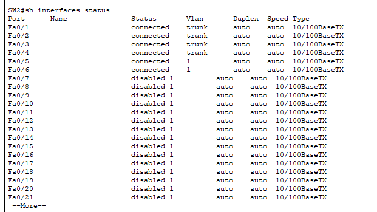

## Port Security Configuration

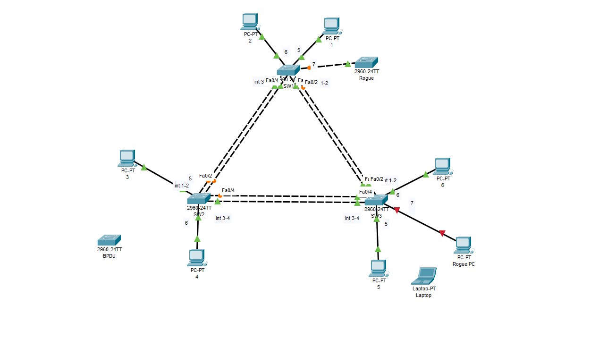

Here’s how you can configure Port Security on your switch ports (e.g., ports 1-24) for end devices:

Enable Port Security on All Ports:
This example assumes you're setting it up on Fa0/1 - Fa0/24, but you can adjust the range based on your needs.
```
SW3(config)# interface range fa0/7
SW3(config-if-range)# switchport mode access
SW3(config-if-range)# switchport port-security
SW3(config-if-range)# switchport port-security maximum 1
SW3(config-if-range)# switchport port-security violation shutdown
SW3(config-if-range)# switchport port-security mac-address sticky
```
+ Connect another PC

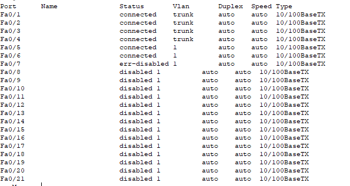

**Explanation of the Commands:**

**switchport port-security:** Enables Port Security on the specified port.\
**switchport port-security maximum 1:** Allows only 1 device to be connected to the port. If more than 1 device is detected, the port will be disabled.\
**switchport port-security violation shutdown:** If a violation occurs (e.g., an unauthorized device connects), the port will be shut down.\
**switchport port-security mac-address sticky:** Automatically learns and stores the MAC addresses of connected devices. If a device is removed and reconnected, it will be allowed as long as its MAC address matches the learned address.

**When to Use Port Security:**
+ Port Security** should be used when you want to restrict which devices are allowed to connect to a port, ensuring that only specific MAC addresses are authorized to access the network.
+ It is useful for preventing unauthorized devices from connecting to your network, reducing the risk of MAC flooding or spoofing attacks.
+ It can be used to ensure that if a device is swapped or disconnected, the new device will need to have its MAC address explicitly configured or be automatically learned (if using sticky MAC address configuration).

**Comparison of Port Security vs BPDU Guard:**
+ **Port Security** is more flexible and can be used on any port to limit which devices (identified by their MAC addresses) are allowed to connect.
+ **BPDU Guard** is focused on preventing BPDU messages from being received on ports where they shouldn't be (usually ports that connect to end devices), preventing unintended changes to STP topology.
+ **Both** features can be used together on the same port, which can provide even more security. Port Security will prevent unauthorized devices from connecting, while BPDU Guard will protect your STP topology from unauthorized switches.

**When to Use Both Together:**
+ Use Port Security on your access ports to limit the number of devices connected based on MAC addresses.
+ Use BPDU Guard on the same ports to prevent unauthorized switches from being added to your network, which could affect your STP topology.

## Project 2: Upgrade to RSTP

**Objective:**
Convert STP to **RSTP** for faster convergence.

Configuration Steps:
Step 1: Change STP Mode to RSTP (on all switches)
```
SW(config)# spanning-tree mode rapid-pvst
```

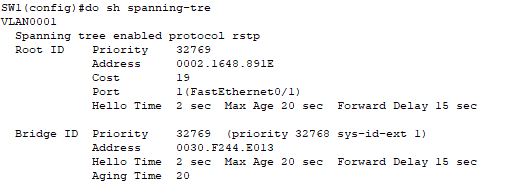

### Verifying RSTP (Rapid Spanning Tree Protocol)

**Check if RSTP is running**
```
SW# show spanning-tree
```

**Verify RSTP state on a specific interface**
```
SW# show spanning-tree interface fa0/1
```
+ Check if the port has switched to Forwarding faster than with standard STP.

**Test RSTP failover**
1. Disconnect one trunk link and measure how fast RSTP recovers (should be near-instant).
2. Run:
```
SW# show spanning-tree
```
+ The previously discarding port should immediately switch to Forwarding.

## Project 3: Upgrade to PVST+ (Per-VLAN Spanning Tree)

**Objective:**
Run **separate STP instances** per VLAN.

**Configuration Steps:**
**Step 1: Create VLANs on All Switches**
```
SW(config)# vlan 10
SW(config)# vlan 20
SW(config)# vlan 30
SW(config)# exit
```
**Step 2: Configure Trunk Ports**
```
SW(config)# interface range fa0/1 - 2
SW(config-if-range)# switchport mode trunk
SW(config-if-range)# switchport trunk allowed vlan 10,20,30
SW(config-if-range)# exit
SW(config)# interface range fa0/3 - 4
SW(config-if-range)# switchport mode trunk
SW(config-if-range)# switchport trunk allowed vlan 10,20,30
SW(config-if-range)# exit
```

**Step 3: Set Root Bridge for Each VLAN
Set SW1 as root for VLAN 10, SW2 for VLAN 20, and SW3 for VLAN 30:**
```
SW1(config)# spanning-tree vlan 10 priority 4096
SW2(config)# spanning-tree vlan 20 priority 4096
SW3(config)# spanning-tree vlan 30 priority 4096
```
### SW3 Problem and why you need to change the maximum Number of MAC Addresses on a Trunk Port


Since a **trunk port** allows traffic from several VLANs, it will likely detect more than one MAC address. This causes the port security limit of **1** to be exceeded, which triggers a **violation** and places the port in **err-disabled** state.

### Solution:
```
SW3(config)# interface range fa0/1 - 4
SW3(config-if)# switchport port-security maximum 132
```
**Step 4: Verify PVST+ Operation**
```
SW# show spanning-tree vlan 10
SW# show spanning-tree vlan 20
SW# show spanning-tree vlan 30
```
Each VLAN should have a different root bridge, optimizing load balancing.

###  Verifying PVST+ (Per-VLAN Spanning Tree)
** Check STP status for a specific VLAN**
```
SW# show spanning-tree vlan 10
SW# show spanning-tree vlan 20
SW# show spanning-tree vlan 30
```
+ Each VLAN should have a different Root Bridge if configured properly.

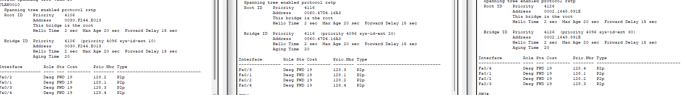


